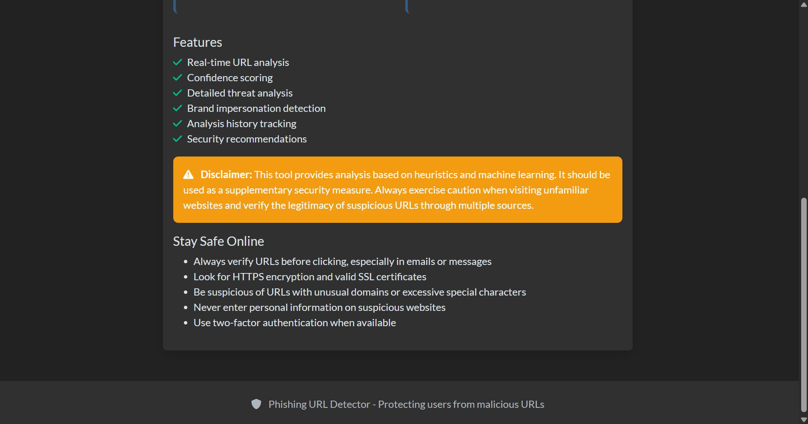

# PhishGuard 🛡️

A Flask-based web application for **real-time phishing URL detection**.  
PhishGuard analyzes suspicious URLs using a combination of **heuristic rules** and **machine learning models**, helping users quickly identify potential phishing attacks.  
It features a dark-themed responsive UI, history tracking with a database, and confidence scoring for predictions.  

---

[](https://your-render-link.onrender.com)

---

## 📖 Overview
Phishing websites are one of the most common cybersecurity threats, tricking users into revealing sensitive information.  
**PhishGuard** provides a simple yet powerful way to check suspicious URLs in real time.  

- **Hybrid Engine** → combines heuristic checks (e.g., suspicious keywords, domains) with machine learning.  
- **Ease of Use** → paste a URL, get results instantly in a clean, dark-themed interface.  
- **Transparency** → shows confidence scores and maintains a history of past analyses.  

---

## 🚀 Features
- Real-time phishing URL detection
- Hybrid detection engine: heuristic + machine learning
- Dark-themed, responsive web UI
- Stores analysis history in SQLite/PostgreSQL
- Confidence scores for classification
- REST API endpoints

---

## 🛠️ Technologies Used
- **Backend**: Flask, SQLAlchemy, scikit-learn  
- **Frontend**: HTML5, Bootstrap 5, JavaScript  
- **Database**: SQLite (local), PostgreSQL (Render)  
- **Deployment**: Render (Gunicorn)  

---

## ⚙️ Setup (Local)

```bash
# Clone the repo
git clone https://github.com/SyedaUlfath/PhishGuard.git
cd PhishGuard

# Create virtual environment
python -m venv venv
source venv/bin/activate  # Linux/Mac
venv\Scripts\activate   # Windows

# Install dependencies
pip install -r requirements.txt

# Run the app
python main.py
```

App runs at: `http://127.0.0.1:5000`

---

## 🌍 Deployment (Render)
1. Push code to GitHub
2. Create new Web Service on [Render](https://render.com)
3. Set:
   - **Build Command**: `pip install -r requirements.txt`
   - **Start Command**: `gunicorn app:app`
4. Add environment variables:
   - `SESSION_SECRET` → a secure random string
   - `DATABASE_URL` → provided by Render (PostgreSQL)
5. Deploy 🎉

---

## 📸 Screenshots

<p align="center">
  
  
</p>
<p align="center"><em>Homepage & URL Scanner</em></p>

<p align="center">
  
  
</p>
<p align="center"><em>Detection results & Analytics dashboard</em></p>

<p align="center">
  
  
</p>
<p align="center"><em>Recent analysis history & Threat statistics</em></p>

<p align="center">
  
  
</p>
<p align="center"><em>Security recommendations & Disclaimer notice</em></p>

---

## 📜 License
This project is licensed under the MIT License © 2025 Syeda Ulfath Qousain.
